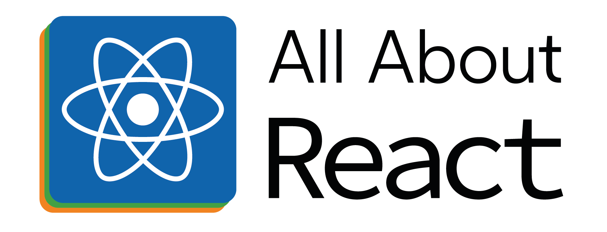

<!-- PROJECT LOGO -->
 

  
  <h2 align="center"><b>All About React</b></h2>
  

    A curated list of react resources from industry experts
  

  

<!-- PROJECT SHIELDS -->
<!--
*** I'm using markdown "reference style" links for readability.
*** Reference links are enclosed in brackets [ ] instead of parentheses ( ).
*** See the bottom of this document for the declaration of the reference variables
*** for contributors-url, forks-url, etc. This is an optional, concise syntax you may use.
*** https://www.markdownguide.org/basic-syntax/#reference-style-links
-->

[![Contributors][contributors-shield]][contributors-url]
[![Forks][forks-shield]][forks-url]
[![Stargazers][stars-shield]][stars-url]
[![Issues][issues-shield]][issues-url]
[![MIT License][license-shield]][license-url]

<!-- ABOUT THE PROJECT -->
## About The Project
This Project is created to help developers master their concepts and expertise in React by learning from articles, talks, and podcasts from industry experts in this domain. 

It serves as a curated list of React material and content to help in learning react in-depth and build a solid foundation of programming concepts. We organized the material topic-wise and categorized it into articles, talks, and podcasts for now. 

<!-- EXPERTS -->
## Experts
These are the react experts to whom content and resources we are referring
<table>
  <tr>
      <td align="center"><a href="#personal_blog"> <b>Andrew Clark</b></a> &nbsp;&nbsp;
      </td>
      <td align="center"><a href="http://www.briandavidvaughn.com"> <b>Brian Vaughn</b></a> &nbsp;&nbsp;
      </td>
      <td align="center"><a href="https://overreacted.io"> <b>Dan Abramov</b></a> &nbsp;&nbsp;
      </td>
      <td align="center"><a href="https://ryanflorence.com"> <b>Ryan Florence</b></a> &nbsp;&nbsp;
      </td>
      <td align="center"><a href="https://kentcdodds.com"> <b>Kent C. Dodds</b></a> &nbsp;&nbsp;
      </td>
      <td align="center"><a href="http://bradwestfall.com"> <b>Brad Westfall</b></a> &nbsp;&nbsp;
      </td>
      <td align="center"><a href="https://mjackson.me"> <b>Michael Jackson</b></a> &nbsp;&nbsp;
      </td>
  </tr>
</table>

<!-- TABLE OF CONTENT -->
## <a id="table-of-contents">Table of Contents</a>

- **[State and Props](#-state-and-props)**
- **[Hooks](#-hooks)**
- **[Rendering](#-rendering)**

<!-- STATE AND PROPS -->
## State and Props [🔝](#table-of-contents)

### Blogs and Articles
- 📜 [Blog link](https://www.google.com)

### Talks
- 🎥 [Video link](https://www.google.com)

### Podcasts
- 🎙️ [Podcast Link](https://www.google.com)

<!-- CONTRIBUTION -->
## Contribution
Contributions are what make the open source community such an amazing place to learn, inspire, and create. Any contributions you make are **greatly appreciated!**.

Please read the [contribution guidelines](CONTRIBUTING.md) first.

<!-- LICENSE -->
## License
Distributed under the MIT License. See `LICENSE` for more information.

<!-- MARKDOWN LINKS & IMAGES -->
<!-- https://www.markdownguide.org/basic-syntax/#reference-style-links -->
[contributors-shield]: https://img.shields.io/github/contributors/Techwards/all-about-react.svg?style=for-the-badge
[contributors-url]: https://github.com/Techwards/all-about-react/graphs/contributors
[forks-shield]: https://img.shields.io/github/forks/Techwards/all-about-react.svg?style=for-the-badge
[forks-url]: https://github.com/Techwards/all-about-react/network/members
[stars-shield]: https://img.shields.io/github/stars/Techwards/all-about-react.svg?style=for-the-badge
[stars-url]: https://github.com/Techwards/all-about-react/stargazers
[issues-shield]: https://img.shields.io/github/issues/Techwards/all-about-react?style=for-the-badge
[issues-url]: https://github.com/Techwards/all-about-react/issues
[license-shield]: https://img.shields.io/github/license/Techwards/all-about-react?style=for-the-badge
[license-url]: https://github.com/Techwards/all-about-react